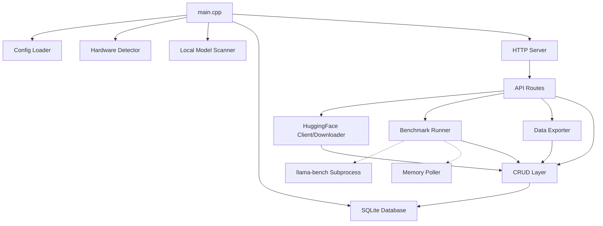

# Architecture

MacBenchForge uses a clean, separated architecture consisting of a C++17 backend and a vanilla HTML/JS/CSS frontend.

## System Overview

## Backend Components

- **Main (`src/main.cpp`)**: The entry point. Loads configuration, initializes the database, detects hardware, scans for existing models, and starts the HTTP server.
- **Config (`src/config/`)**: Parses `config.toml` using `toml++`.
- **Database (`src/db/`)**: Uses `SQLiteCpp` to manage local state (models, downloads, hardware info, benchmark configurations, and results).
- **Hardware (`src/hardware/`)**: Uses macOS native APIs (`sysctl`, `IOKit`, `mach`) to detect Apple Silicon specs and poll memory usage.
- **Discovery (`src/discovery/`)**: Scans the filesystem for `.gguf` files.
- **HuggingFace (`src/huggingface/`)**: Uses `libcurl` to query the HF API and download models on background threads.
- **Benchmark (`src/benchmark/`)**: Spawns `llama-bench` as a subprocess, parses its JSON output, and coordinates memory polling.
- **Server (`src/server/`)**: Uses `cpp-httplib` to provide a REST API and serve static frontend files.

## Frontend

The frontend is a lightweight Single Page Application (SPA) located in the `frontend/` directory.
- **No Build Tools**: It uses vanilla HTML5, CSS3, and ES6 JavaScript.
- **Theming**: Heavily utilizes CSS custom properties for a premium dark mode glassmorphism UI.
- **Charts**: Visualizations are powered by `Chart.js` loaded via CDN.
- **API Client**: A simple wrapper (`js/api.js`) handles all communication with the C++ backend.
